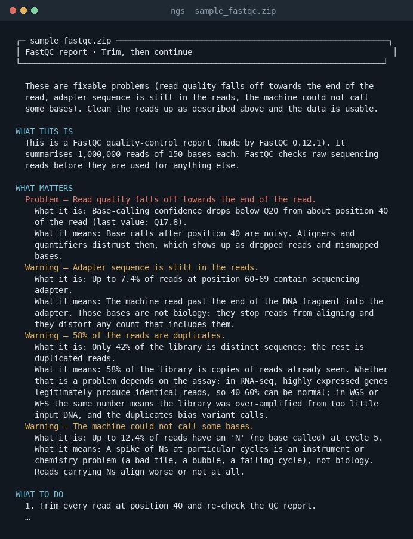

<div align="center">

# NGS-Agent

**Quality checks and pipeline-log diagnosis for NGS runs.**

Reads FastQC and MultiQC reports, run folders, VCFs, and workflow logs. Findings include the rule, evidence location, and file hash.

[Quickstart](#60-second-quickstart) · [Supported inputs](#supported-inputs) · [Watch a live run](#watch-a-live-run) · [Receipts](#receipts)

</div>



## 60-second quickstart

Python 3.11 or newer:

```bash
git clone https://github.com/ranaalyan1/NGS-Agent.git && cd NGS-Agent
python -m venv .venv && .venv/bin/pip install -e ".[dev]"
.venv/bin/python -m doors.cli fixtures/fastqc/sample_fastqc.zip
.venv/bin/python -m doors.cli fixtures/runs/contig_mismatch
.venv/bin/python -m uvicorn doors.gui.app:app --host 0.0.0.0 --port 8000
```

Open `http://localhost:8000` for the Box. The CLI identifies inputs by content; it does not need a file-type option or configuration file.

### Install options

```bash
# Isolated command-line install
pipx install "ngs-agent[box] @ git+https://github.com/ranaalyan1/NGS-Agent.git"
ngs sample_fastqc.zip

# Conda
git clone https://github.com/ranaalyan1/NGS-Agent.git && cd NGS-Agent
conda env create -f environment-box.yml && conda activate ngs-agent-box

# Docker: Box on port 8000
docker build -t ngs-agent .
docker run --rm -p 8000:8000 ngs-agent
```

## Supported inputs

| Input | Checks and verdict |
|---|---|
| FastQC `.zip` | Six read-quality rules: healthy, trim and proceed, or re-sequence. |
| MultiQC JSON, table, or HTML | The same six rules per sample, plus cohort checks. |
| Run folder | Ten cross-file audit rules: healthy, review, or fix and re-run. |
| Nextflow log | Ten failure signatures; one root cause or an honest unknown. |
| Snakemake log | Eight ranked failure signatures; root cause or unknown with the log tail. |
| Cromwell log | Five failure signatures; root cause or unknown with the log tail. WDL source is recognised, not analysed. |
| VCF or `.vcf.gz` | Five call-quality checks for one sample. No variant interpretation. |

### Read-quality rules

| Rule | Detects |
|---|---|
| `QC-QUAL-01` | Base quality below Q20 |
| `QC-ADAPT-01` | Adapter sequence above 5% |
| `QC-DUP-01` | Duplication, with RNA-seq versus WGS context |
| `QC-GC-01` | A narrow GC spike |
| `QC-N-01` | High fraction of uncalled bases |
| `QC-LEN-01` | Inconsistent read lengths |

### Run-folder audit

| Rule | Detects |
|---|---|
| `AUD-STRAND-01` | Mismatched chromosome naming with assignment below 30% |
| `AUD-STRAND-02` | Strandedness setting inconsistent with counts |
| `AUD-CONTAM-02` | Contamination above 3% |
| `AUD-DUP-04` | A sample with unusually high duplication versus its cohort |
| `AUD-TRUNC-01` | An incomplete alignment file |
| `AUD-BUILD-01` | Mixed genome builds |
| `AUD-COUNT-01` | Normalised values where raw counts are expected |
| `AUD-PAIRED-01` | Paired-end libraries counted as single-end |
| `AUD-ADAPT-03` | Adapter read-through from short fragments |
| `AUD-ALIGN-01` | Alignment rate below 75% |

`fixtures/runs/contig_mismatch` reproduces a run where every step exits 0, but only 18% of reads are assigned to genes. The audit catches the chromosome-name mismatch between the alignment and annotation.

### VCF call-quality checks

These rules evaluate call quality, not variant truth:

| Rule | Metric |
|---|---|
| `QC-VCF-01` | Median depth and fraction of sites below depth 10 |
| `QC-VCF-02` | Fraction of sites with missing genotypes |
| `QC-VCF-03` | Ti/Tv balance; only extreme outliers are flagged |
| `QC-VCF-04` | Het/hom ratio outlier |
| `QC-VCF-05` | PASS, unfiltered, and other FILTER fractions |

The supported sample limit is **one**. gVCFs, multi-allelic records, and visibly non-minimal indels are recognised but not judged. Whole-genome and exome Ti/Tv expectations differ; the tool does not infer assay type. A healthy QC verdict says nothing about pathogenicity, gene context, or ACMG classification.

## Watch a live run

Poll a growing Nextflow log every 15 seconds. Change the interval with `--interval`. The watcher reads the file without modifying it and holds judgement on an incomplete final line.

```bash
ngs --watch --interval 15 results/nextflow.log
```

Complete evidence triggers a `LIVE` verdict and next action. Ctrl+C prints a final snapshot: exit code 0 if no failed finding has appeared, otherwise 1. At normal completion, the final card matches one-shot `ngs results/nextflow.log` output.

## Run it inside your pipeline

`examples/nf-core/NGS_AGENT.nf` defines an optional process. Enable it with `params.ngs_agent`; provide the Nextflow log and MultiQC output paths. It runs the published image with a read-only root filesystem and publishes HTML reports under `results/ngs-agent/`. Findings do not fail the process unless `ngs_agent_fail_on_error` is enabled.

```nextflow
include { NGS_AGENT } from './examples/nf-core/NGS_AGENT.nf'
if (params.ngs_agent) { NGS_AGENT(
  Channel.value(file(params.nextflow_log)),
  Channel.value(file(params.multiqc_output)), params.ngs_agent_fail_on_error ?: false
)}
```

## The Box and reports

Run the web interface with:

```bash
.venv/bin/python -m uvicorn doors.gui.app:app --host 0.0.0.0 --port 8000
```

Upload a supported file at `http://localhost:8000`. The Box uses the same assessment code as the CLI and offers a downloadable, self-contained HTML report. Use `ngs <path> --json` for the verdict and receipts as JSON.

## Receipts

Each finding identifies its rule or signature and cites the source file, line, and content hash. For example:

```text
QC-QUAL-01: rule:QC-QUAL-01 @ Per base sequence quality — ruleset 2026-09.1
QC-QUAL-01: file:751e79c3d819 @ sample_fastqc/fastqc_data.txt:line=28
            — Per base sequence quality mean = 17.8 at position 40-49 (threshold Q20)
```

If the input is unsupported or evidence is insufficient, the verdict is **unknown** rather than a guess. VCF metric receipts also appear in the JSON verdict.

## Exit codes

| Code | Meaning |
|---:|---|
| `0` | Pass or warnings only |
| `1` | At least one failed finding |
| `2` | Input could not be interpreted |

## Scope

NGS-Agent reads results; it does not run or orchestrate pipelines. Core makes no network calls and the tool uploads no files. Verdict text uses fixed templates and measured values.

It does not do VCF pathogenicity, gene-context, or ACMG analysis; WDL source is not statically analysed. Pipeline execution, MCP, accounts, authentication, and cloud uploads are out of scope. Unsupported or unrecognised inputs return an honest unknown. See [ROADMAP.md](ROADMAP.md) for coverage and planned work.

## Development

```bash
python -m pytest
python scripts/make_fixtures.py
python scripts/make_screenshot.py
```

Tests cover parsing, rules, fixtures, and the receipts audit. Fixtures are generated byte-identically by `scripts/make_fixtures.py`.

## Licence

Apache-2.0 · [LICENSE](LICENSE)
