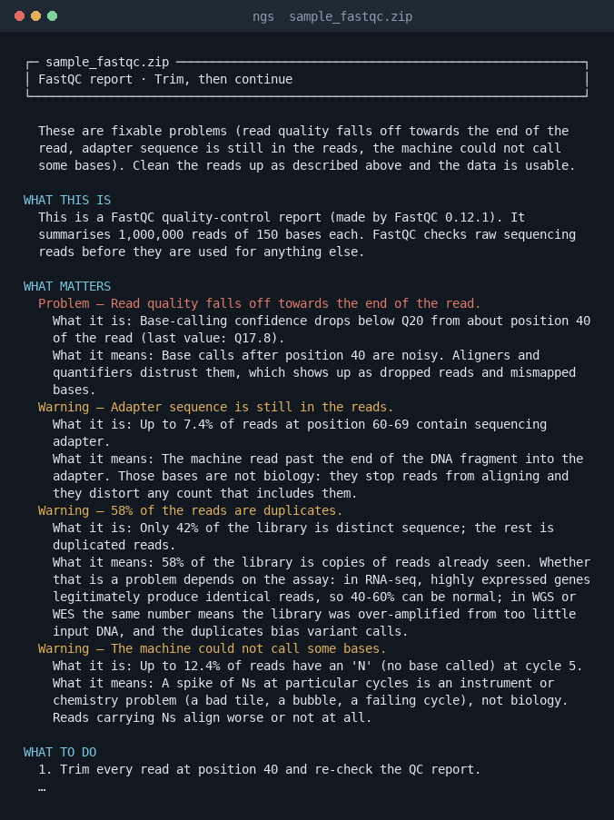
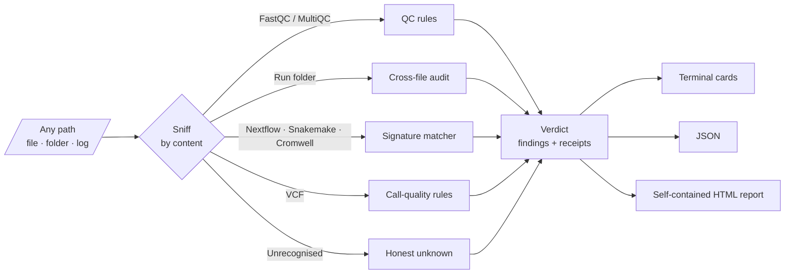

<div align="center">

<h1>🧬 NGS-Agent</h1>

<h3>Every pipeline step exited 0. Can you trust the result?</h3>

<p>
NGS-Agent reads the output of a sequencing run (QC reports, run folders, VCFs and workflow logs)<br/>
and returns a <b>plain-language verdict</b>. Every claim is backed by a <b>receipt</b>: the rule, the file, the line and the hash.
</p>

<p>
<a href="https://github.com/ranaalyan1/NGS-Agent/actions/workflows/test.yml"></a>

<a href="LICENSE"></a>


</p>

<p>
<a href="#60-second-quickstart"><b>Quickstart</b></a> ·
<a href="#what-it-catches"><b>What it catches</b></a> ·
<a href="#how-it-works"><b>How it works</b></a> ·
<a href="#receipts"><b>Receipts</b></a> ·
<a href="#watch-a-live-run"><b>Live watch</b></a> ·
<a href="#run-it-inside-your-pipeline"><b>Nextflow</b></a> ·
<a href="#scope">Scope</a>
</p>

</div>

<table>
<tr>
<td width="55%">



</td>
<td width="45%">

### What you get

- 🔎 **Detects the input from its content.** No flags, no file-type options, no config file.
- 🧾 **Receipts for every finding.** Rule ID, source file, line number and SHA-256.
- 🗣️ **Plain-language answers.** Four fixed blocks: *what this is*, *what matters*, *what to do*, *receipts*.
- 🚦 **CI-friendly exit codes.** `0` pass · `1` fail · `2` unknown.
- 🤐 **Says "unknown" when it can't tell.** No guessing and no generated prose. Verdicts come from fixed templates filled with measured values.
- 🔒 **Local only.** Core makes no network calls and uploads nothing.
- 🖥️ **Three ways to run it.** Command line, a browser drop box ("the Box"), or a step inside your Nextflow pipeline.

</td>
</tr>
</table>

---

## 60-second quickstart

You need Python 3.11 or newer:

```bash
git clone https://github.com/ranaalyan1/NGS-Agent.git && cd NGS-Agent
python -m venv .venv && .venv/bin/pip install -e ".[dev]"
.venv/bin/python -m doors.cli fixtures/fastqc/sample_fastqc.zip
.venv/bin/python -m doors.cli fixtures/runs/contig_mismatch
.venv/bin/python -m uvicorn doors.gui.app:app --host 0.0.0.0 --port 8000
```

Then open **http://localhost:8000** and drop a file on the Box.

> [!TIP]
> Start with `fixtures/runs/contig_mismatch`. Every step in that run exited 0, yet only **18%** of reads were assigned to genes. NGS-Agent finds the cause: the BAM names chromosomes `1` and the GTF names them `chr1`. That is the kind of silent failure this tool is built to catch.

<details>
<summary><b>📦 Other install options: pipx · conda · Docker</b></summary>

```bash
# Isolated command-line install
pipx install "ngs-agent[box] @ git+https://github.com/ranaalyan1/NGS-Agent.git"
ngs sample_fastqc.zip

# Conda
git clone https://github.com/ranaalyan1/NGS-Agent.git && cd NGS-Agent
conda env create -f environment-box.yml && conda activate ngs-agent-box

# Docker: runs the Box on port 8000 (health check at /healthz)
docker build -t ngs-agent .
docker run --rm -p 8000:8000 ngs-agent
```

</details>

---

## What it catches

| Input | What NGS-Agent does | Possible verdicts |
|---|---|---|
| 📊 **FastQC** `.zip` | 6 read-quality rules | healthy · trim and proceed · re-sequence |
| 📑 **MultiQC** JSON, table or HTML | The same 6 rules per sample, plus cohort outlier checks | per sample and cohort |
| 📁 **Run folder** | 10 cross-file audit rules | healthy · review · fix and re-run |
| 🌊 **Nextflow** log | 10 failure signatures | root cause · honest unknown |
| 🐍 **Snakemake** log | 8 ranked failure signatures | root cause · unknown plus the log tail |
| 🏗️ **Cromwell** log | 5 failure signatures (WDL source is recognised but not analysed) | root cause · unknown plus the log tail |
| 🧬 **VCF** / `.vcf.gz` | 5 call-quality checks for a single sample | healthy · review |

<details open>
<summary><b>Read-quality rules (FastQC and MultiQC)</b></summary>

| Rule | Detects |
|---|---|
| `QC-QUAL-01` | Base quality below Q20 |
| `QC-ADAPT-01` | Adapter sequence above 5% |
| `QC-DUP-01` | Duplication, judged differently for RNA-seq and WGS |
| `QC-GC-01` | A narrow GC spike |
| `QC-N-01` | A high fraction of uncalled bases |
| `QC-LEN-01` | Inconsistent read lengths |

</details>

<details open>
<summary><b>Run-folder audit: problems that only show up when files are compared</b></summary>

| Rule | Detects |
|---|---|
| `AUD-STRAND-01` | Chromosome naming differs between BAM and annotation, and fewer than 30% of reads are assigned |
| `AUD-STRAND-02` | The strandedness setting does not match the counts |
| `AUD-CONTAM-02` | Contamination above 3% |
| `AUD-DUP-04` | One sample has much higher duplication than the rest of the cohort |
| `AUD-TRUNC-01` | An incomplete (truncated) alignment file |
| `AUD-BUILD-01` | Mixed genome builds |
| `AUD-COUNT-01` | Normalised values where raw counts are expected |
| `AUD-PAIRED-01` | Paired-end libraries counted as single-end |
| `AUD-ADAPT-03` | Adapter read-through caused by short fragments |
| `AUD-ALIGN-01` | Alignment rate below 75% |

</details>

<details>
<summary><b>Workflow-log failure signatures (Nextflow, Snakemake, Cromwell)</b></summary>

| Engine | Signatures |
|---|---|
| **Nextflow** | `NF-OOM-001` out of memory · `NF-INPUT-002` missing input · `NF-STAR-003` STAR index does not match the reference · `NF-CONT-004` container pull failed · `NF-DISK-005` disk full · `NF-JAVA-006` Java heap · `NF-BAM-007` truncated BAM · `NF-PAIR-008` read files do not pair · `NF-REF-009` reference not found · `NF-PERM-010` permission denied |
| **Snakemake** | `SM-INPUT-001` missing input · `SM-AMBIG-002` ambiguous rule · `SM-TARGET-003` unknown target · `SM-WILDCARD-004` wildcards · `SM-CONDA-005` conda env · `SM-JOB-006` job failed · `SM-INCOMPLETE-007` incomplete output · `SM-CYCLE-008` dependency cycle |
| **Cromwell** | `CW-CALL-001` failed call · `CW-SHARD-002` shard retries exhausted · `CW-BACKEND-003` backend error · `CW-LOCALIZE-004` localization failed · `CW-CAPTURE-005` stdout/stderr capture |

Signatures are plain YAML files in [`core/signatures/`](core/signatures), so you can read and review them.

</details>

<details>
<summary><b>VCF call-quality checks</b></summary>

These rules judge **call quality**, not whether a variant is real:

| Rule | Metric |
|---|---|
| `QC-VCF-01` | Median depth and fraction of sites below depth 10 |
| `QC-VCF-02` | Fraction of sites with missing genotypes |
| `QC-VCF-03` | Ti/Tv balance (only extreme outliers are flagged) |
| `QC-VCF-04` | Het/hom ratio outlier |
| `QC-VCF-05` | PASS, unfiltered and other FILTER fractions |

Supported: **one sample** per file. gVCFs, multi-allelic records and visibly non-minimal indels are recognised but not judged. Ti/Tv expectations differ between whole-genome and exome data, and the tool does not guess the assay type.

</details>

---

## How it works


```mermaid
flowchart LR
    A[/"Any path<br/>file · folder · log"/] --> B{"Sniff<br/>by content"}
    B -->|FastQC / MultiQC| C["QC rules"]
    B -->|Run folder| D["Cross-file audit"]
    B -->|Nextflow · Snakemake · Cromwell| E["Signature matcher"]
    B -->|VCF| F["Call-quality rules"]
    B -->|Unrecognised| U["Honest unknown"]
    C & D & E & F & U --> V["Verdict<br/>findings + receipts"]
    V --> T["Terminal cards"]
    V --> J["JSON"]
    V --> H["Self-contained HTML report"]
```

The CLI, the Box and the JSON output all come from **the same verdict object**, so they always agree. The "doors" (`doors/cli.py`, `doors/gui/app.py`) contain no analysis logic. Every threshold lives in `core/rules/`.

---

## Receipts

Every finding names its rule or signature and points to the exact evidence:

```text
QC-QUAL-01: rule:QC-QUAL-01 @ Per base sequence quality — ruleset 2026-09.1
QC-QUAL-01: file:751e79c3d819 @ sample_fastqc/fastqc_data.txt:line=28
            — Per base sequence quality mean = 17.8 at position 40-49 (threshold Q20)
```

If the input is unsupported or the evidence is insufficient, the verdict is **unknown**. The test suite includes a receipts audit that fails if any finding is created without a valid receipt.

## Exit codes

| Code | Meaning | Typical use |
|---:|---|---|
| `0` | Pass, or warnings only | Continue the pipeline |
| `1` | At least one failed finding | Stop and fix |
| `2` | Input missing or could not be interpreted | Send it to a human |

```bash
ngs results/multiqc_data.json --json > verdict.json || echo "NGS-Agent flagged this run"
```

---

## Watch a live run

Point the watcher at a Nextflow log that is still growing:

```bash
ngs --watch --interval 15 results/nextflow.log
```

- The log is opened **read-only** and is never modified. The watcher waits if the last line is incomplete.
- A `LIVE` card and the next action appear as soon as there is complete evidence of a failure.
- When the run finishes, the final card is identical to one-shot `ngs results/nextflow.log` output.
- Ctrl+C prints a final snapshot and exits `0` if nothing failed, otherwise `1`.

## Run it inside your pipeline

[`examples/nf-core/NGS_AGENT.nf`](examples/nf-core/NGS_AGENT.nf) is an optional process you can add to a pipeline. It runs the published image with a read-only root filesystem and writes HTML reports to `results/ngs-agent/`. Findings only fail the process if you set `ngs_agent_fail_on_error`.

```nextflow
include { NGS_AGENT } from './examples/nf-core/NGS_AGENT.nf'

if (params.ngs_agent) {
    NGS_AGENT(
        Channel.value(file(params.nextflow_log)),
        Channel.value(file(params.multiqc_output)),
        params.ngs_agent_fail_on_error ?: false
    )
}
```

## The Box and reports

```bash
.venv/bin/python -m uvicorn doors.gui.app:app --host 0.0.0.0 --port 8000
```

Drop a file on the page at `http://localhost:8000`. The Box uses the same assessment code as the CLI and offers a **downloadable, self-contained HTML report** that you can email or archive. See [`docs/sample_report.html`](docs/sample_report.html) for an example. For machine-readable output, use `ngs <path> --json`.

---

## Scope

NGS-Agent **reads results. It does not run or orchestrate pipelines.** Core makes no network calls and the tool uploads no files. Verdict text is built from fixed templates and measured values.

It does not do VCF pathogenicity, gene-context or ACMG analysis, and WDL source is not statically analysed. Pipeline execution, MCP, accounts, authentication and cloud uploads are out of scope. Unsupported or unrecognised inputs return an honest unknown. Coverage and planned work are tracked in [ROADMAP.md](ROADMAP.md).

## Development

```bash
python -m pytest                   # full suite; integration tests self-skip without docker
make lint                          # ruff check + format check
make typecheck                     # mypy
python scripts/make_fixtures.py    # regenerate fixtures (byte-identical)
python scripts/make_screenshot.py  # re-render docs/images/quickstart.png from real CLI output
```

The suite covers parsing, every rule, every fixture, the docs themselves, and the receipts audit.

<details>
<summary><b>Repository layout</b></summary>

```text
core/        sniffing, parsers, rules, signatures, verdict model (the product)
doors/       thin front ends: cli.py (ngs) and gui/ (the Box)
fixtures/    deterministic test inputs, generated by scripts/make_fixtures.py
examples/    Nextflow integration
ngs_agent/   legacy and agentic (v2) CLIs, kept for existing installs
agents/      container swarm agents (optional)
tests/       pytest suite
```

</details>

## License

Released under the **Apache-2.0** license. See [LICENSE](LICENSE).

<div align="center">
<sub>Built for bioinformaticians who want the evidence along with the answer.</sub>
</div>
